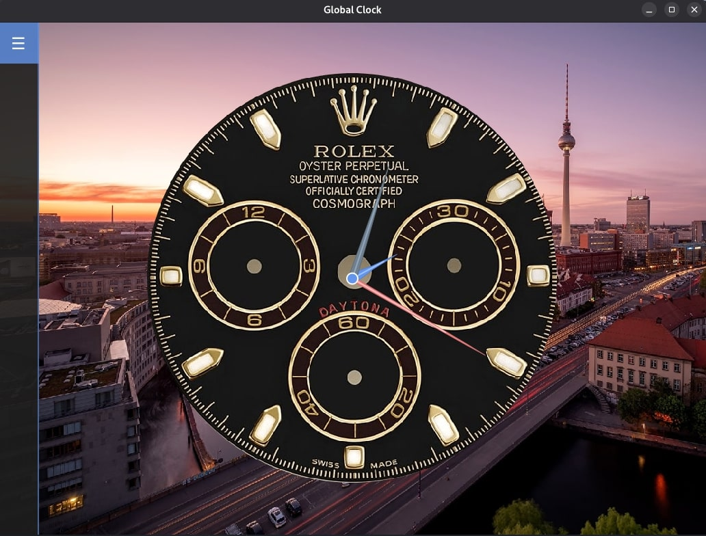
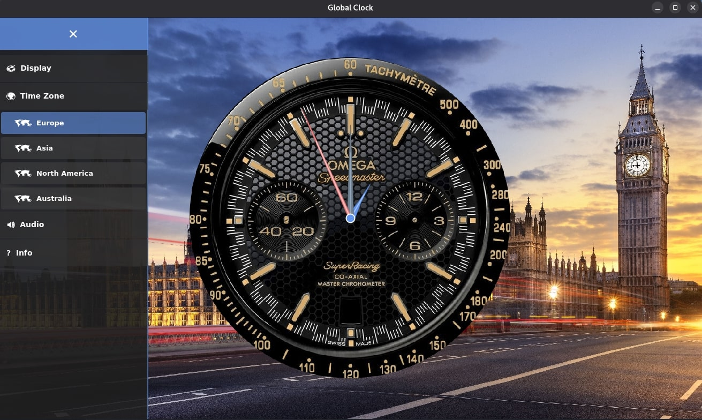
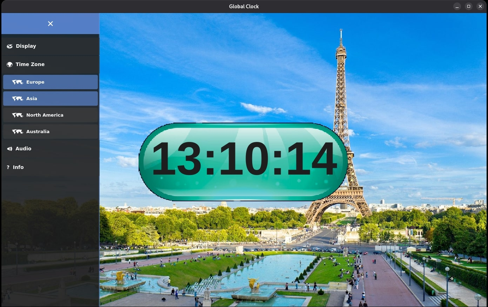

# Global Clock

A powerful global clock application that allows users to view the current time in multiple time zones around the world. It supports both digital and analog clock styles, with sound effects for a more immersive experience. Built using Python and Tkinter for a user-friendly graphical interface.

## Features
- **Multiple Time Zones:** Displays the current time for 16 different cities across the world.
- **Digital and Analog Clocks:** Choose between a digital clock or an analog clock to suit your style.
- **Tick-Tock Sound:** Adds a ticking sound effect for a more realistic clock experience.
- **Customizable Styles:** Easily switch between different clock styles and settings.
- **Real-Time Updates:** Time is updated continuously for all selected time zones.
- **Lightweight UI:** Simple and responsive user interface that adapts to any screen size.


*Berlin Clock Style*


*London Clock Style*


*Paris Clock Style*

## Supported Cities
The clock supports the following cities from around the world:

- New York (EST)
- Los Angeles (PST)
- London (GMT)
- Paris (CET)
- Tokyo (JST)
- Sydney (AEDT)
- Mumbai (IST)
- Moscow (MSK)
- Beijing (CST)
- Dubai (GST)
- Cape Town (SAST)
- São Paulo (BRT)
- Buenos Aires (ART)
- Cairo (EET)
- Mexico City (CST)
- Toronto (EST)

## Installation

To get started with the project, clone this repository and install the necessary dependencies:

```bash
git clone https://github.com/CipherChaos/Global-Clock.git
```
Make sure you are in the project directory
```bash
cd Global-Clock
```
Install the required dependencies (libraries) using the following command
``` bash
pip install -r requirements.txt
```
Run the project 
``` bash
python main.py
```
##  Building Executables

Build standalone executables using PyInstaller.

### Windows

Create GlobalClock.exe:

``` bash
pyinstaller --name GlobalClock --onefile --windowed -icon clock/medias/clock.ico --add-data "clock/assets;clock/assets" --add-data "clock/medias;clock/medias" main.py
```

Inside of `dist/` directory you can find GlobalClock.exe 

### Linux

Create Linux binary:

``` bash
pyinstaller --name GlobalClock --onefile --windowed -icon clock/medias/clock.svg --add-data "clock/assets;clock/assets" --add-data "clock/medias;clock/medias" main.py
```

Make executable:

``` bash
chmod +x dist/GlobalClock
```

#### Add to Linux Applications Menu (Optional):

1- Create and open the desktop file 

``` bash
nano ~/.local/share/applications/globalclock.desktop
```
2- Copy the new `desktop` file configs based on your path

``` bash
[Desktop Entry]
Type=Application
Name=Global Clock
Exec=/home/YOURUSER/.local/bin/GlobalClock
Icon=/home/YOURUSER/path/to/icon.png
Terminal=false
Categories=Utility;

```

3- Make desktop file executable:

``` bash
chmod +x ~/.local/share/applications/globalclock.desktop
```

4- Copy binary to system path:

``` bash
sudo cp dist/GlobalClock /usr/local/bin/
```

